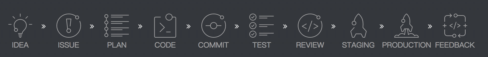
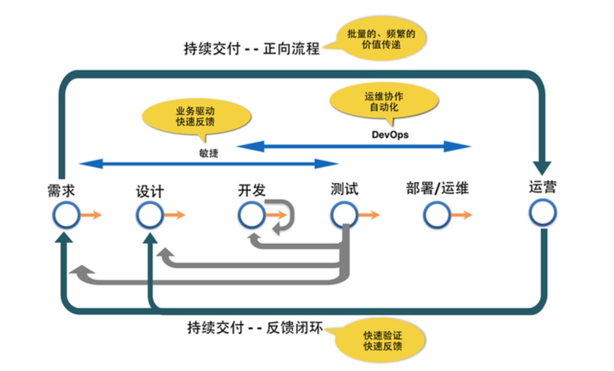

# 持续交付

## 什么是持续交付

`概念`持续交付(Continuous Delivery)是一系列的开发实践方法，用来确保让代码能够快速、安全的部署到产品环境中，它通过将每一次改动都提交到一个模拟产品环境中，使用严格的自动化测试，确保业务应用和服务能符合预期。因为使用完全的自动化过程来把每个变更自动的提交到测试环境中，所以当业务开发完成时，你有信心只需要按一次按钮就能将应用安全的部署到产品环境中。

> 持续交付并不是指软件每一个改动都要尽快的部署到产品环境中。它指的是任何的修改都已证明可以在任何时候实施部署。
>
> — Carl Caum (@ccaum) [August 28, 2013](https://twitter.com/ccaum/statuses/372620989257232384)

### 为什么提出持续交付

#### 软件的度量

传统的管理方法论，其实不论是瀑布模型，还是迭代开发的方式，或者其他的方法论，周期时间的缩短都是至关重要的。而具体到周期内，单纯的开发时间变长或者测试时间变长都无关紧要。比如项目A的开发时间是测试时间的2倍，项目B则恰恰反过来，这并不能说A做的比B好，真正有意义的是A的周期时间是否比B更短。单纯改善项目过程中的某一个阶段的时间，可能并不能达到预期的目的。局部优化并不一定会带来全局的优化。换言之，**通过某些策略来提高软件测试的效率未必能减少周期时间！**。

#### 持续交付的提出

传统情况下，企业要进行软件开发，从用户研究到产品上线，其中会花费数月，甚至数年（我的一位印度同事给我聊起过，他的上家公司做产品，从版本启动到版本上线需要整整两年时间！）。而且一旦软件需求发生变更，又有需要数月才能将变更发布上线。除了为变更提交代码外，还有很多额外的回归测试，发布计划，运维部门的进度等等。而市场机会千变万化，在特定的时间窗口中，企业的竞争者可能早已发布并占领了相当大的市场份额。

在软件工程领域，人们提出了持续交付（continuous delivery）的概念，它旨在减少周期时间，强调在任何时刻软件都处于可发布状态。采用这种实践，我们可以频繁，快速，安全的将需求的变化发布出来，交由真实世界的用户来使用，在为用户带来价值的同时，我们也可以快速，持续的得到反馈，并激励新的变化产生（新的商业创新，新的模式等）。

持续交付包含了自动化构建，自动化测试以及自动化部署等过程，持续改进开发流程中的问题，并促进开发人员，测试人员，运维人员之间的协作，团队可以在分钟级别将变更发布上线。

`从技术上讲`，持续交付是软件系统的构建、部署、测试、审核、发布过程的一种自动化实现，而其中的核心则是部署流水线。因为部署流水线能够将这几个环节有效地连接起来。对于任何一个可交付的软件来说，必然要经历分析、设计、开发、测试、构建、部署、运维的过程。而从持续交付的角度来分析，对于任何一个可部署的独立单元，它都应该有一套独立的交付机制，来有效支撑其开发、测试、构建、部署与运维的整个过程。

##### 项目周期图

##### 持续交付图

## 如何实现持续交付

从`交付`的角度来分析，对于任何一个可部署的独立单元，它都应该有一套独立的部署流水线，来有效支撑其开发、测试、构建、部署与运维的整个过程。

从`周期`的角度来分析，我们可以分成两个部分，一个是敏捷开发：需求->计划->编码->测试，一个是devops：编码 -> 集成 -> 部署 -> 交付。这两部分组成了我们整个交付周期。因此要实现持续交付我们可以从以下几个方面入手。

- 快速发布。能够应对业务需求，并更快地实现软件价值。
- 编码->测试->上线->交付的频繁迭代周期缩短，同时获得迅速反馈；
- 高质量的软件发布标准。整个交付过程标准化、可重复、可靠，
- 整个交付过程进度可视化，方便团队人员了解项目成熟度；
- 更先进的团队协作方式。从需求分析、产品的用户体验到交互 设计、开发、测试、运维等角色密切协作，相比于传统的瀑布式软件团队，更少浪费。

#### 需求

核心是**任务协作系统**，需要合理分工。规划展示和追踪工作进度，并且同步给所有有需要知道的人。

我们使用gitlab的基于项目的issue管理，有任务协作的主体功能：

- List，任务列表，紧急程度和优先级，Assignee，责任人。指定这个 issue 由谁负责来解决。

- Labels，标签。包括 enhancement、bug、invalid 等，表示 issue 的类型，解决的方式。除了自带的以外，也可以去自定义。
- Milestone，里程碑。通常用来表示项目的一个阶段，比如demo、release等，保护达成这些阶段需要解决的问题。有时候，也会与版本计划重合，比如v1.0、v2.0等。issue不能设置截止时间，但是milestone可以。 此外，由于每个问题都定有里程碑，每当一个问题解决，它会自动更新进度条。
- Board，任务看板，基本上有todo\doing\done

额外，issues是和版本控制（git）打通，能够更好的反馈任务状态。

- 可以通过issue建立 git **分支**
- 可以通过git commit选择性的与某个 issue **关联**

总之可以起到了良好的**过程管理**作用，使得项目进度更加显然。大幅降低协作成本。

#### 开发

> 基于gitlab的研发工作流 [workflow完整文档](/cd/workflow.md)

- 定义环境
  - 本地开发环境
  - 开发联调环境
  - 内网稳定测试环境
  - `生产仿真环境 `
  - 生产环境
- 项目约定
  - Gitlab-ci.yml
  - Bin\servcie.sh
  - Build\build.sh
- 快速开发和构建
- 测试用例实现

#### 测试&持续集成&部署

> 测试和持续集成都是为了保证快速交付的质量，同时也影响交付速度
>
> 详细文档 ***[CI/CD完整文档](/cd/cicd.md)***

- 测试

  - 功能交互体验测试，测试人员主导，初期在联调环境进行，合并主干后在内网测试环境进行
  - 功能测试，项目里对所有的功能做自动化测试，API覆盖率尽量做到100%
  - 性能测试 和 安全测试，通过扫描工具实现

- 持续集成，每次功能开发完成，开发人员合并主干，主干接受merge后，都应在集成机上进行自动构建和自动测试。使用 GitLab CI + Docker进行持续集成。
  - 全面的自动化测试。这是实践持续集成&持续部署的基础，同时，选择合适的自动化测试工具也极其重要
  - 灵活的基础设施。基于docker的容器技术
  - 版本控制工具。gitlab。
  - 自动化的构建和软件发布流程的工具
  - 反馈机制。如构建/测试的失败，可以快速地反馈到相关负责人，以尽快解决达到一个更稳定的版本。

- 持续部署，如果持续集成通过，自动推动到内网稳定测试环境，交付整体验收测试，测试通过。项目负责人负责合并到生产分支，触发部署，部署到线上代码库

#### 周期管理

> 没有考核的目标是没有意义的

- 跟踪过程，衡量产出

- 复盘总结，发现问题

整体流程如下图所示：

]

### 示例

[一个持续交付周期](/cd/example.md)  演示持续交付一个需求迭代的周期是怎么操作的

### 参考资料

* [持续交付概述](http://exceedhl.thoughtworkers.org/cd/cd.html)
* [谈谈持续集成，持续交付，持续部署的区别](http://www.jianshu.com/p/2c6ebe34744a)
* [持续交付和持续部署的区别](http://www.oschina.net/news/45444/continuous-delivery-vs-continuous-deployment-whats-diff)
* [微服务与持续交付](http://www.open-open.com/lib/view/open1451440541448.html#articleHeader0)
* [穷人的持续集成与持续交付](http://blog.jobbole.com/97109/)

